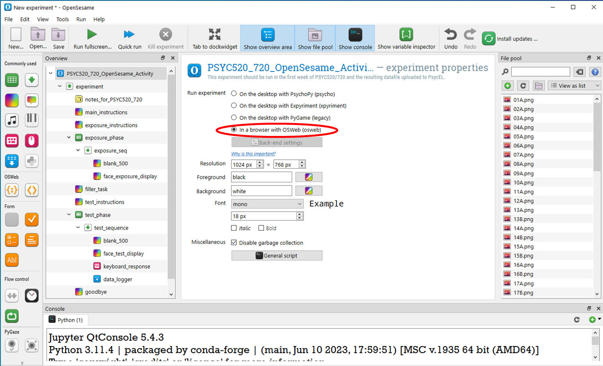
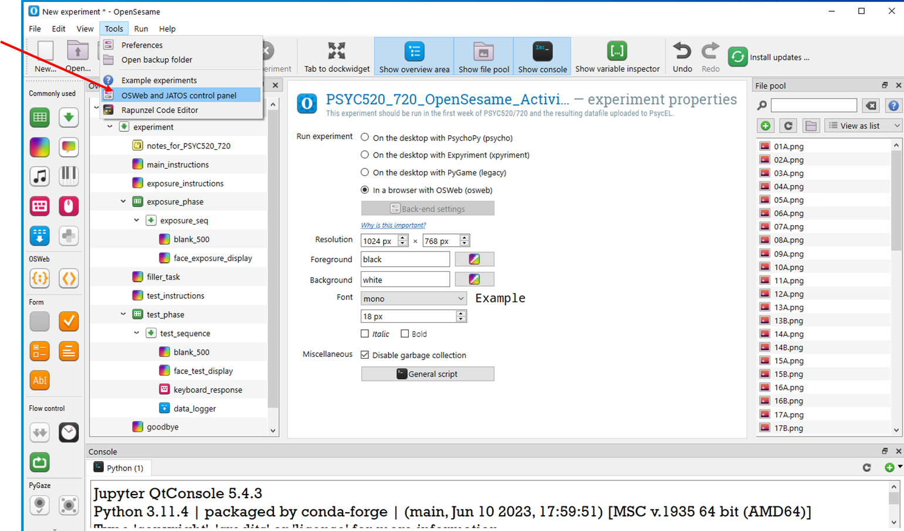
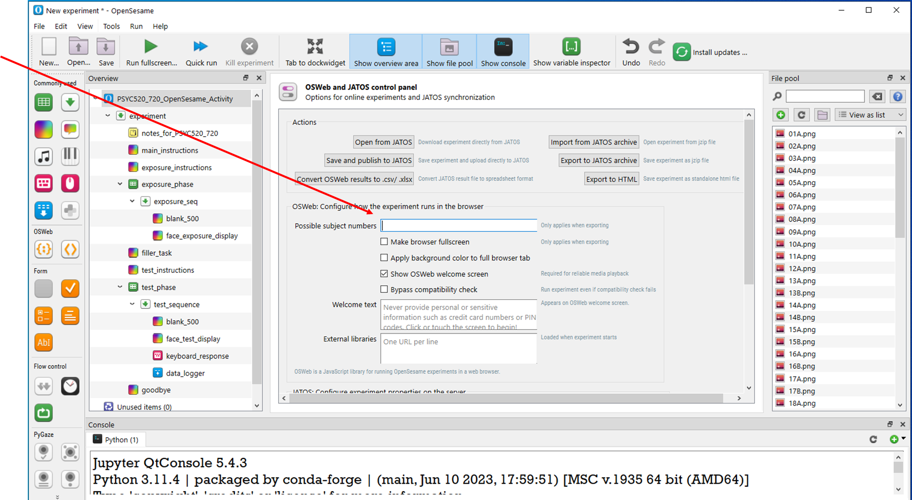
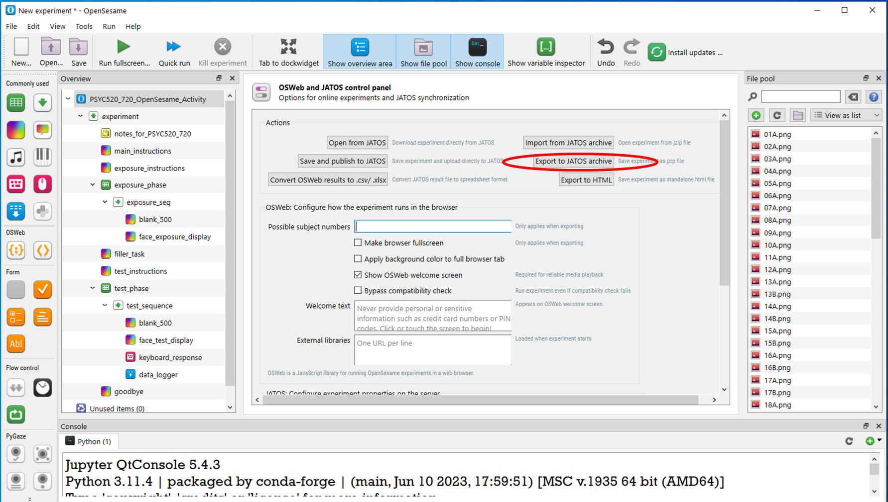

# Preparing your online study

_Julien Besle_

This document assumes that you have build your experiment using OpenSesame version 4.0.24
(Instructions for OpenSesame version 3.x are given in this [document](presentations/prepare_your_online_study.pptx))

## Introduction

The OpenSesame experiment normally runs on a local computer. A few things have to be done to turn this into an online study. The school has its own JATOS server which hosts these online studies. You have been given an account on this server:      

https://jatos.plymouth.ac.uk/jatos/login

You will eventually give participants online links that allow them to run your study in any browser.

To export your OpenSesame script to a format that can be used on JATOS, follow these instructions:

### Step 0: Go through the [check list](checklist.md) to make sure your OpenSesame experiment works correctly

### Step 1. Test your program to see if it’s compatible with running online.

In the experiment properties, check “in a browser with OSweb” 

Run your experiment as usual. It should open in a browser window (we recommend Google Chrome).

If it doesn’t run properly in the browser view, it won’t run online!

Once you have tested that your experiment works as expected in a browser, remember put this setting back to “On the desktop with Expyriment” if you want to test your experiment further on your laptop

### Step 2. Export the Experiment to a .jzip file

Open the “OSWeb and JATOS control” panel from the “Tools” menu

### Step 3. Export the Experiment to a .jzip file

Make sure you delete the "0, 1" values in the “possible subject number” field

### Step 4. Export the Experiment to a .jzip file

Click the “Export to JATOS archive” button

This will turn your program into a jzip file (.jzip extension) – save this file.

### Step 5. The jzip file that you saved is now ready to be uploaded to the JATOS server.

Watch the [Uploading an OpenSesame Experiment](https://youtu.be/EMHwUMI4JOI) video for instructions on how to do this.

If you have multiple osexp experiment files (e.g. one for each between-subjects condition in your study) you will do this for each file.

### Step 6. Send both your osexp experiment script(s) and the corresponding JATOS link(s) to your group leader, so they can check that everything is working 

