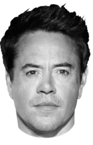

# Face Processing

## Holistic processing of faces and the composite face effect

### Overview

Holistic processing refers to one way in which faces are perceived and processed. It refers to the processing of all aspects of the face (e.g. features, spatial relations between features and so on) as a single representation. One way of investigating holistic processing of faces is through the use of the compoiste face effect. A composite face is one in which the top half of individual's face has been paired with the bottom half of another person's face. An example is shown below. Can you identify the top half of the face? What about the bottom half?

People tend to find this task difficult because the two halves of the face are fused together to create a new, holistic, representation of a face. However this representation does not match any face you know, you find the task harder. Constrast this with the image below in which the two halves are misaligned.

In this image the two halves have been separated and the task becomes notably easier. This is because the two halves are no longer fused into a single holistic representation. You are then able to process the two halves with relative ease. (If you are still stuck [click here](holistic_ans.md) to find out who these people are). The term **composite face effect** refers to the difficulty people have with processing an *aligned* composite face as opposed to the relative ease in which they process a *misaligned* composite face.

This example demonstrates the composite face effect can influence the recognition of identity. Here are some papers that have looked at other aspects of face processing that are influenced by the composite face effect.

### Resources

Hole, G.J. (1994). Configurational factors in the perception of unfamiliar faces. *Perception*, *23*, 65 - 74, [DOI:10.1068/p230065](http://sro.sussex.ac.uk/id/eprint/14457/1/p230065.pdf)

Hugenberg, K. & Corneille, O. (2009). Holistic processing is tuned for in-group faces. *Cognitive Science*, *33*, 1173 - 1181 [DOI:10.1111/j.1551-6709.2009.01048.x](https://onlinelibrary.wiley.com/doi/full/10.1111/j.1551-6709.2009.01048.x)

Zhao, M. & Hayward, W.G. (2010). Holistic processding underlies gender judgements of faces. *Attention, Perception and Psychophysics*, *72*, 591 - 596 [DOI:10.3758/APP.72.3.591](https://link.springer.com/content/pdf/10.3758%2FAPP.72.3.591.pdf)